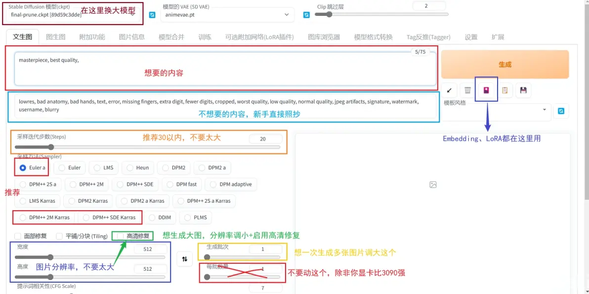
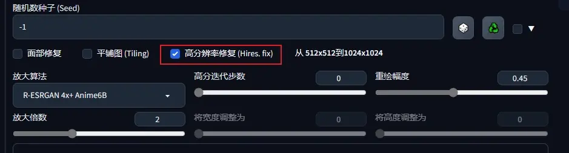
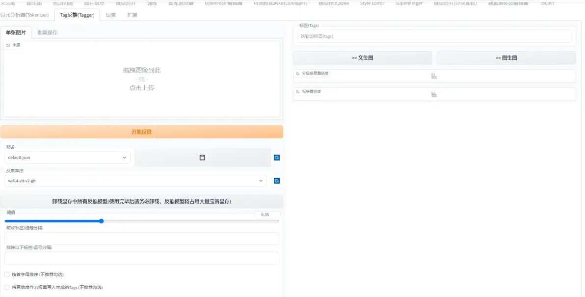
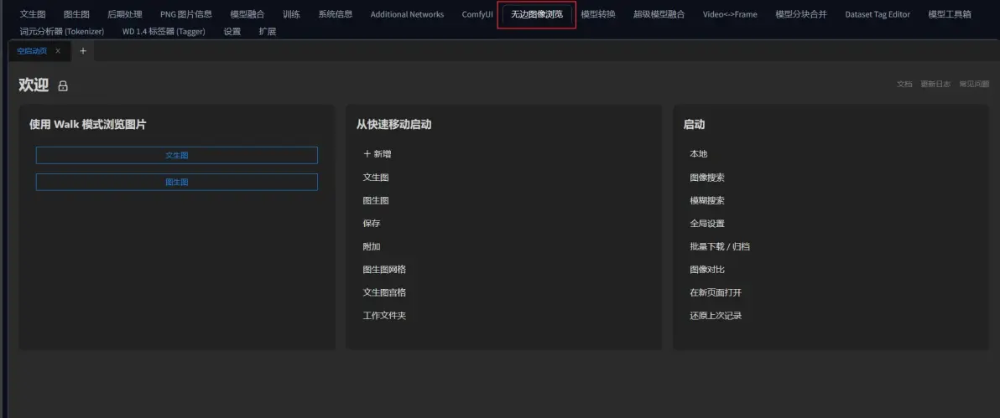
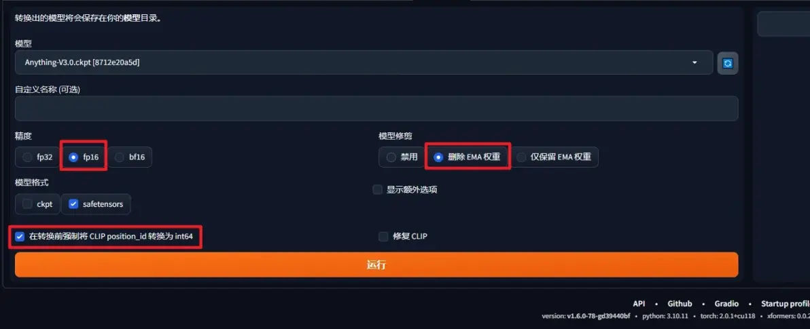

https://www.bilibili.com/opus/768529619802390537

**一图流教程**

**常用 Tag**

> 正面 Tag（想要的内容）是这些，改善画质用的 Tag：
>
> masterpiece, best quality,

> 通用反面 Tag（不想要的内容），保底不出古神用的 Tag：
>
> lowres, bad anatomy, bad hands, text, error, missing fingers, extra digit, fewer digits, cropped, worst quality, low quality, normal quality, jpeg artifacts, signature, watermark, username, blurry

整合包内一般都会带一个自动补全 Tag 的插件，如果你不知道那些 Tag 好，可以使用标签超市：https://tags.novelai.dev/ 。

**Tag 权重**

另外，你可能会看到别人发的 Tag 里面会有一些符号？比如大小括号等等。这属于进阶用法，这里仅仅简单提及一下。以 girl 这个 Tag 作为例子。

(girl) 加权重，这里是1.1倍。括号是可以叠加的，如（(girl)) 加很多权重。1.1*1.1=1.21倍。

[girl] 减权重，一般用的少。减权重也一般就用下面的指定倍数。

(girl:1.5) 指定倍数，这里是1.5倍的权重。还可以 (girl:0.9) 达到减权重的效果。

**采样步数**

不需要太大，一般在50以内。通常28是一个不错的值。

**采样器**

没有优劣之分，但是他们速度不同。全看个人喜好。推荐的是图中圈出来的几个，速度效果都不错。

**提示词相关性**

代表你输入的 Tag 对画面的引导程度有多大，可以理解为 “越小AI越自由发挥”，太大会出现锐化、线条变粗的效果。太小AI就自由发挥了，不看 Tag。

**随机种子**

**生成过程中所有随机性的源头** 每个种子都是一幅不一样的画。默认的 -1 是代表每次都换一个随机种子。由随机种子，生成了随机的噪声图，再交给AI进行画出来。

**为生成的图片进行放大**

生成的图片又糊，细节又不好看？直接拉大分辨率又出鬼图？正确的做法是下面的。

AI 基本上无法生成超级大图，想要生成高清图片正确的做法是分辨率调小，比如512x768，然后开启 “高清修复”。

如果你不会用，照抄我的参数就可以了。放大倍数请考虑自己的显存大小调整，太大会爆显存。

**查询图片参数**

AI生成图片会自动保存全部参数到原图中，可以在WebUI的 “图片信息” 一栏内通过解析原图查看到。也可以使用我写的这个工具：https://spell.novelai.dev/

非AI生成图片或经过压缩的图片推荐使用 WD14Tagger 来尝试反推tag。

Tagger是一个插件，在新版的整合包内也帮你装好了，可以在顶栏找到。打开后拖入图片，AI会识别出一些tag。如果没有这个插件的话需要你自行安装，安装教程参考下面的插件管理部分。

**使用ControlNet精细控制画面**

[链接](../使用ControlNet精细控制画面)

**使用X/Y图表**

在生成图片时候，可以使用x/y图表快速生成不同参数的图片进行对比。

一个图表示例，常用做对比图

[x-y-z-图表](https://guide.novelai.dev/guide/configuration/param-advanced#x-y-z-图表)

**使用图库浏览器**

使用图库浏览器插件管理生成的图片。新版整合包内置了 “无边图像浏览” 的插件，可以快速查看图片以及生成信息

**安装/管理/更新插件**

通过 WebUI 自带的插件管理系统安装插件，并且及时更新。推荐使用启动器进行更新插件，更为快捷。

[【AI绘画】插件安装/更新/设置/卸载教程：基础教程补完计划](https://www.bilibili.com/opus/771354028958285827)

**进阶使用**

**更换模型来达到不同的画风/认识不同人物、物体**

参考以下文章。

目前可以见到的模型有：大模型、Embedding模型、Hypernet模型、LoRA模型

常用的有：大模型、LoRA模型。

[【AI绘画】全部模型种类总结 / 使用方法 / 简易训练指导——魔导绪论](https://www.bilibili.com/opus/753964591130607682)

**大模型推荐**

[【【AI绘画】4月模型推荐榜 大模型/LoRA 看看AI都能画出哪些东西了？】](https://www.bilibili.com/video/BV1em4y1z7Dg/?share_source=copy_web&vd_source=fa5dd04600101d6cbd7396c154a826de)

[【【AI绘画】5-6月模型推荐榜 大模型/LoRA 看看这俩月AI又有什么进化吗？】](https://www.bilibili.com/video/BV1Nk4y1T7ft/?share_source=copy_web&vd_source=fa5dd04600101d6cbd7396c154a826de)

[【【AI绘画】7-9月模型推荐榜 大模型/LoRA 刑！超绝可爱系专辑~】](https://www.bilibili.com/video/BV1v8411y7uR/?share_source=copy_web&vd_source=fa5dd04600101d6cbd7396c154a826de)

[【【AI绘画】1月模型推荐榜 超多画风！表情包也是它画的？23年10月~24年1月 大模型/LoRA SDXL 模型分享】](https://www.bilibili.com/video/BV14a4y127DA/?share_source=copy_web&vd_source=fa5dd04600101d6cbd7396c154a826de)

**用模型合并来混合风格**

（待更新：mbw等新型合并）

**模型剪裁**

网上下载到的别人融合的模型经常会有非常多的垃圾，请使用我写的“模型转换”插件，按照如下操作修剪模型

详细解释如下

[**【AI绘画】模型修剪教程：8G模型顶级精细？全是垃圾！嘲笑他人命运，尊重他人命运**](https://www.bilibili.com/opus/837018632699510789)

**使用高级提示词语法**

提示词权重、分步渲染相关内容

[教程](https://guide.novelai.dev/guide/prompt-engineering/txt2img#提示词语法)

**带师级别使用**

**自己进行训练模型**

[LoRA](https://www.bilibili.com/video/BV1AL411q7Ub/?vd_source=81efa03d913fb7381fcbe19b0c0b98d3)
