# 1. 前言

在浏览器输入Github.com回车，你将会进入全世界最强的资源网站、代码网站、学习网站。
这份教程将会全面讲解 Git 与 Github 的所有相关知识。
从 Github 的每一个按钮每一个功能细节再到 Git 版本控制系统的入门到精通，最后扩展到开源项目的协作流程与团队管理。

我将会对以上内容进行深入且系统的讲解。

# 2. 什么是 Git 与 Github？

## 2.1 Git 是什么？
**代码的“时间机器” + 多人协作的“分身术”**
它是一个帮你管理代码修改历史的工具，能随时回到过去的任意版本，还能让多人同时改代码不冲突（比如你和同事同时改一份文件, Git 会智能合并）。

**核心功能一句话总结：**

1. 存快照：每次保存代码时，Git 会拍一张照片（commit），记录此刻所有文件的状态。
2. 开分支：像平行宇宙一样，新建一个独立空间改代码，改好了再合并回主线（比如测试新功能不影响主版本）。
3. 看历史：随时查看谁、什么时候、改了哪行代码（查BUG）神器。
4. 不怕丢：即使删了代码，也能从历史记录里一键恢复。

**举个例子：**

- 你写了一半的代码改崩了 → 用 Git 一键回到昨天能运行的状态。
- 你和同事同时改同一个文件 → Git自动合并两人的修改，如果冲突会提醒你们协商解决。
- 想实验一个高风险功能 → 开个新分支随便折腾，失败了直接删掉，不影响主代码。（静悄悄地干，输了当没干过。——雷军）

---

## 2.2 Github是什么？

**代码的“网盘” + 协作工具**

你可以把它想象成一个专门存代码的云端仓库，但它比普通网盘更强大——不仅能存代码，还能记录每次修改、多人协作、自动处理代码冲突，甚至搭建个人网站。

**核心功能一句话总结：**

1. 存代码：把你的项目（代码、文档等）存在云端，随时取用。
2. 看变化：记录每次修改（比如昨天删除了哪行代码，今天谁加了新功能）。
3. 多人协作：10个人同时改代码不会乱，自动合并修改。
4. 找灵感：全球最大的开源社区，可以直接学习别人的代码（比如特斯拉自动驾驶代码库就公开在Github）。

**比喻一下就是：**

Github = 代码界的微博 + 多人实时协作的 WPS文档 + 程序员的作品集展示平台

## 2.3 Git 与 Github 的关系

Git 是底层的版本控制工具，负责本地代码的版本管理和操作；Github 则是基于 Git 的上层服务平台，提供了远程代码托管、协作和社交等功能。开发者通常在本地使用 Git 进行代码管理，然后将代码推送到 Github 上进行共享和协作。

**一句话记忆**：Git 是“**工具**”，Github 是“**用这个工具存代码的网站**”

# 3. 准备工作

在我们学习使用 Github 网站之前必须要解决一个重要的问题，Github是一个国外的网站，国内访问Github的时候经常会出现速度慢、连接失败等情况。这里我介绍一种方式给 Github 加速。这两种方法都使用了开源免费的软件而且久经验证广受好评，可以说是安全稳定。

## 3.1 Watt Toolkit 

官方网站：https://steampp.net/

这个软件其实就是之前的 Steam++ ，现在改名叫 Watt Toolkit，这是一个开源免费的跨平台的多功能加速器，在官网找到对应自己系统的版本下载即可，如果你是Windows系统也可以在微软商店搜索安装。

使用方式：

1. 右键以管理员身份运行
2. 左侧栏选择网络加速
3. 勾选 Github
4. 点击右上角的**一键加速**按钮
5. 访问 Github （https://github.com/）测试 。

在软件的**流量统计**选项卡可以看到流量经过该软件代理，现在我们使用Github的速度比以前快了很多。

# 4. Github网站基础介绍

本节我们在Github上面创建一个自己的账号并简单介绍 Github 的基础功能

## 4.1 注册

1. 访问 Github（https://github.com/）

2. 右上角点击`Sign up` 注册
3. 填写自己的邮箱 - 点击`Continue`继续
4. 输入密码 - 点击`Continue`继续
5. 输入用户名（英文），取个自己喜欢好记，以后你的仓库都是放到你的英文名路径下面的- 点击`Continue`继续
6. 勾选 Email preferences 可以收到Github的新闻邮件。（可选）- 点击`Continue`继续
7. 完成人机验证
8. 输入邮箱收到的验证码
9. 登录

登录后可能有个小问卷，简单填写一下即可。

- 你的团队有多少个人 - Just me
- 你是一个学生还是老师 - N/A
- 你对 Github 的哪个功能比较感兴趣 - Collaborative coding
- 选择免费版还是团队版 - 选择左边的免费版

## 4.2 简单编辑个人主页

至此我们已经成功登录进来了，在浏览器输入：https://github.com/NicholasHao，github.com/后面是你的英文名回车访问，这里就是自己的主页了，在这里可以编辑自己的头像、个人介绍等等。

## 4.3 配置双重身份验证

如果以后你想在Github上提交代码，这个步骤是必须的，强烈建议现在就配置好。

进入Github的首页 - 右上角点击自己的头像

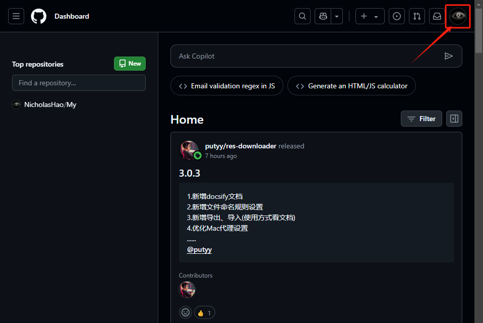

点击 **Settings**

点击左侧的 **Password and authentication**

向下滑点击 **Enable two-factor authentication** 启用双重身份验证

进来之后我们需要扫描一个二维码

手机打开应用商店下载安装微软的 **Authenticator**

打开 Authenticator 点击右上角的 **+** 号

您添加的账户类型是什么 - 点击**个人账号**

添加个人账户 - 点击**扫描QR码**

扫描屏幕上的**二维码**

扫描完成手机上就会多出一个GitHub账号与**动态密码**

这个动态密码就是我们的双重身份验证

回到**浏览器**输入**动态密码**

接下来这一步非常重要，下载保存好你的恢复码。

这个恢复码是在你的双重验证丢失的时候（比如说你的手机）使用来登录的

**一定要把它下载并且保存好**

**一定要把它下载并且保存好**

**一定要把它下载并且保存好**

建议把这恢复码多备份几份，比如放到你自己的网盘、U盘里

点击 **I have saved my recovery codes** 下一步

点击 **Done**

至此我们的双重身份验证就配置好了。

## 4.4 储存库基础介绍

Github最核心的页面 repository 也叫存储库、代码仓库

这里我用著名Minecraft启动器HMCL项目来作例子

项目地址：https://github.com/HMCL-dev/HMCL

我们来看这个网址，这个网址分成了三部分

- github.com - Github的主域名
- HMCL-dev - 开发者的名字
- HMCL - 仓库的名字

Github中所有的仓库都遵循这样的命名规则

### 4.4.1 代码库

进入这个仓库最显眼的部分是中间的代码库

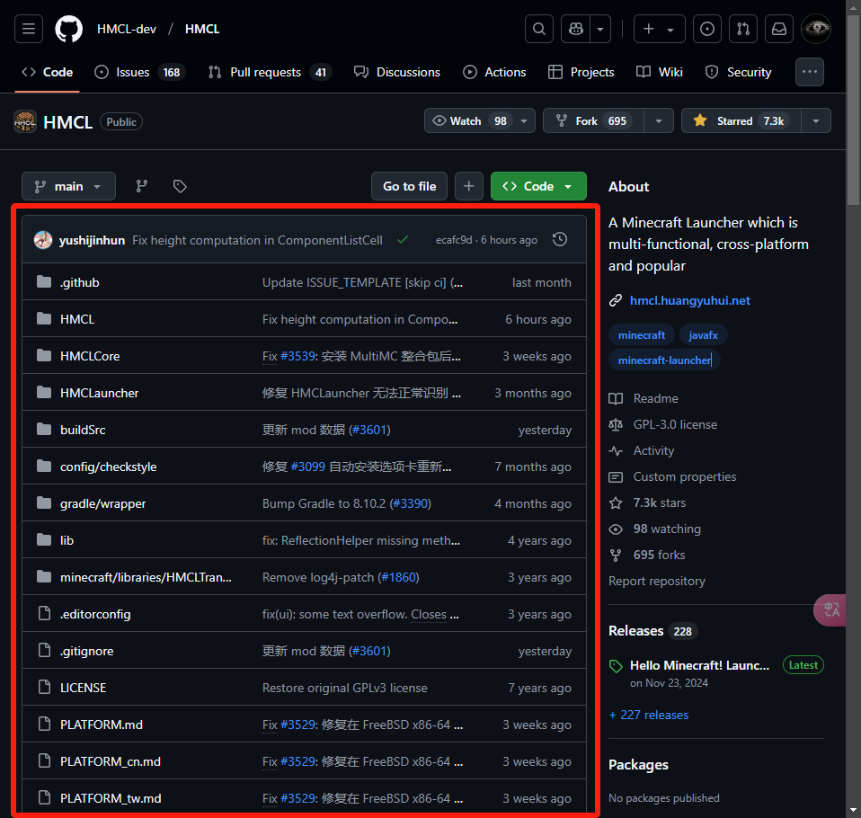

这里存放的是整个项目的源代码，我们可以直接点开查看里面的内容，也可以点击右上方的Code按钮选择Download ZIP把代码作为压缩包整个的下载下来。

代码库的每个文件后面都有两条信息。

- 第1个是commit message 也就是作者最后一次提交代码的备注，本教程后面我们会反复的和commit打交道，目前我们先简单了解一下

- 第二条是最后一次的提交日期，如果一个项目中的所有文件更新日期都是很多年前，那就代表这个项目可能很久没人维护了

### 4.4.2 项目的说明

代码库的下面是项目的说明

 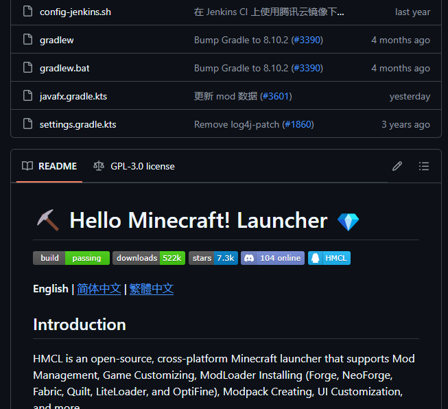

Github会自动读取README.md文件并把其中的内容展示在这里。

有关README.me文件以及其中的Markdown语法我们后面会进行详细介绍。

README文件一般展示了项目的基础信息，如介绍项目是做什么用的、解决了什么问题、以及如何使用等信息。

### 4.4.3 Releases模块

这里面记录了项目发布版本的信息。

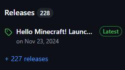

点击进入可以看到Assets

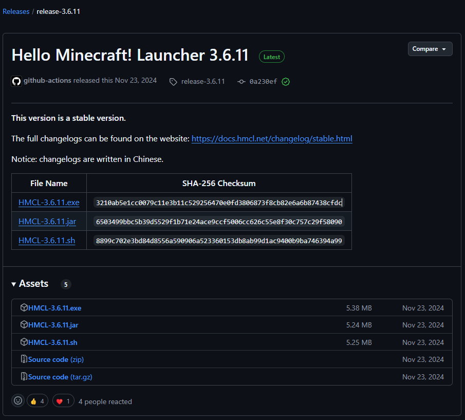

这里一般有作者打包好的软件，下载下来就可以直接启动

Release中包含项目的版本号、这个版本所有的更新内容

我们可以按需要选择不同的版本进行下载

### 4.4.4 About 模块

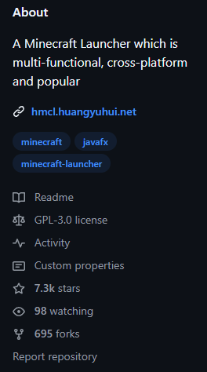

这里包括了项目的简介、标签、说明文档、开源协议、stars数、分支数等

### 4.4.5 Star 星标

stars类似收藏数，能够反映项目的热度，如果你对项目感兴趣不妨给作者点一个star

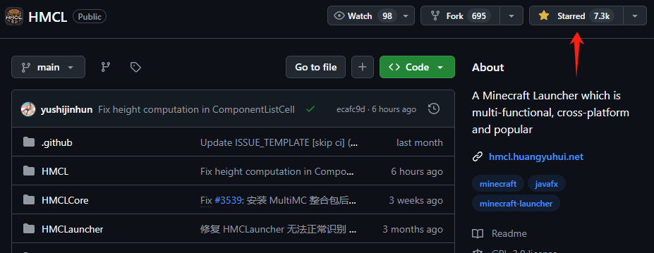

### 4.4.6 Fork 复刻

复刻，指的是把项目保存一份到自己的名下

点击Fork - 点击Create fork

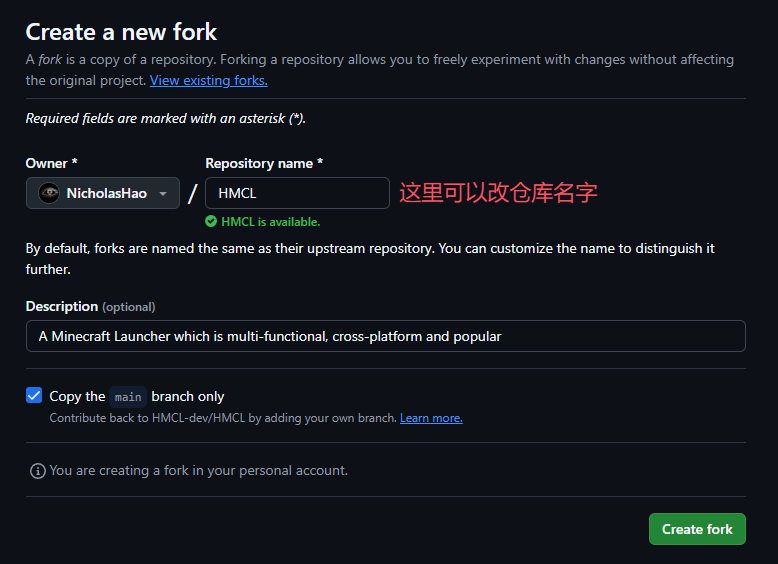

可以看到产生了一个一模一样的仓库到了自己的名下。

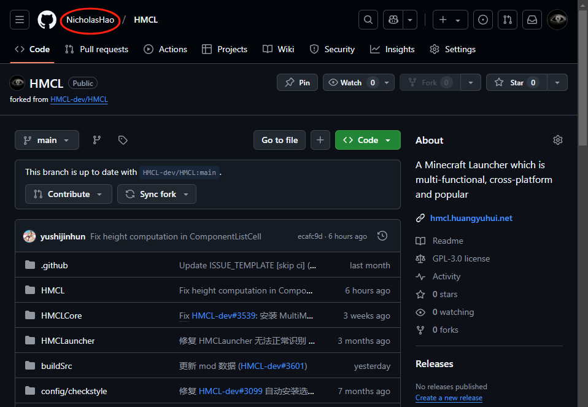

fork可以帮助我们更深入的学习源代码，可以根据自己的需求对源代码进行DIY

还可以尝试把自己的修改通过Pull Request（合并请求）合并进作者的主代码库为开源项目添砖加瓦。

### 4.4.7 搜索

 在最上面的放大镜图标是Github的搜索功能，你可以在这里对项目进行搜索，也可以吧前缀的搜索条件删掉来搜索整个Github上面的内容与资源

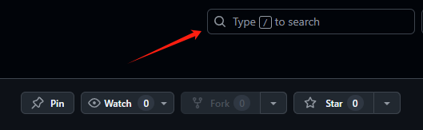

### 4.4.8 Issue 议题

这是Github一个重要功能，这里你可以发起议题。

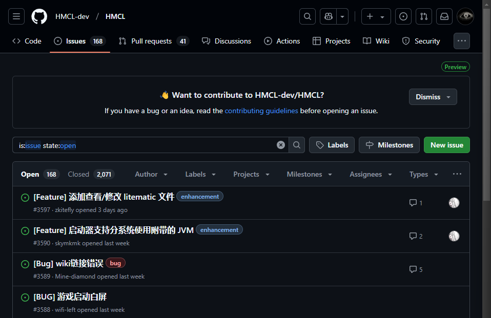

我们可以点击New Issue按钮发起新的议题，比如提出你在项目中遇到的bug、建议帮助对项目进行完善。除此以外我们还可以参与议题帮助其他人解决问题。

issue分成两种 Open / Closed。

Open 一般指的是还没有解决议题。

Closed 则是指的已经解决的Bug或已经结束的议题。

在使用或学习开源项目遇到问题的时候可以在点击Closed查看已结束的题或搜索一下，因为你遇到的问题大概率其他人也遇到过，并且在issue里面已经有人给出了解决方案。

## 4.5 汉化 / 翻译

不习惯Github的英文界面？没关系这里有两款工具可以帮到你。

### 4.5.1 GitHub 汉化插件

https://github.com/maboloshi/github-chinese

这个用于汉化Github的界面，在项目的说明里面有它的使用方法

### 4.5.2 沉浸式翻译

[https://chromewebstore.google.com/detail/沉浸式翻译-网页翻译插件-pdf翻译-免费/bpoadfkcbjbfhfodiogcnhhhpibjhbnh](https://chromewebstore.google.com/detail/沉浸式翻译-网页翻译插件-pdf翻译-免费/bpoadfkcbjbfhfodiogcnhhhpibjhbnh)

这是个浏览器插件，可以用于翻译整个网页（我主要用来翻译看不太懂的README文件）。 

安装完成初始化设置后可以在窗口的右边见到一个粉红色按钮，点击即可对网页进行翻译。

建议还是不使用汉化，养成习惯，其实没有多难的。

另外就是因为翻译结果有时候会产生偏差，在某些关键概念上产生歧义 。

## 4.6 快捷键

用好快捷键可以使你事半功倍。

`/` - 打开Github搜索功能

`T` - 快速定位到文件搜索栏

`L` - 快速定位到行号（假设你在看一个文件，可以按下`L`输入20回车快速跳转到第20行）

这里展开说一下行号左边的`···`点击有好几个功能可以使用

Copy line - 复制行

Cope permalink - 复制永久链接

View git blame - 浏览Git追溯（查看文件提交历史）

View file in GitHub.dev - 在Github.dev中查看文件

View file in different branch/tag 查看不同分支/标签中的文件 快捷键`W`

`?` 打开快捷键速查表 所有的快捷键都在这里

`.` 打开网页版VS Code

# 5. 发现工具 寻找灵感

1. 下载好用的工具
2. 收藏项目，关注开发者
3. 下载学习开源代码
4. 自行DIY，添加功能
5. 为开源项目做出贡献

## 5.1 Explore 探索

https://github.com/explore

左边是你的星标主题、星标仓库

中间是自动推荐的内容，你也可以点击标签页进入不同的分类查看

右边的是热门仓库（每日热榜）今天在Github上热度最高的项目，这个模块下面有个See more trending repositories链接，点击可以打开更详细的热门仓库列表，里面还可以设置过滤器来设置条件筛选项目，如母语、项目语言以及日期范围

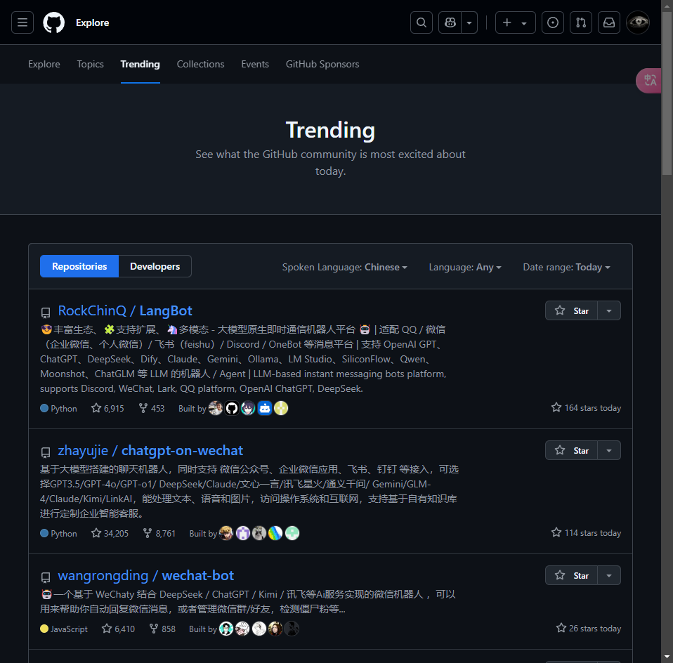

## 5.2 Search 搜索

https://github.com/search

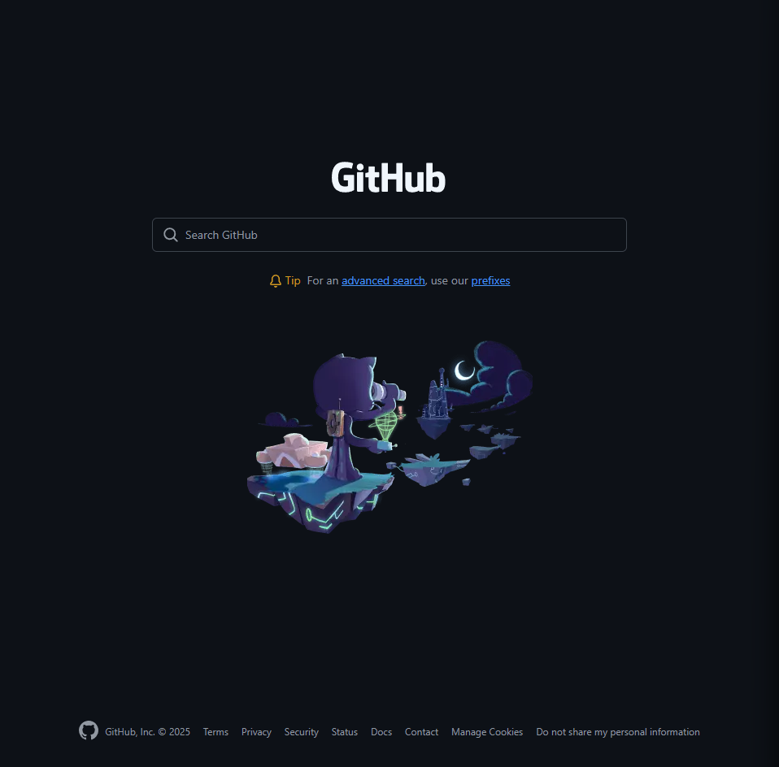

这个是Github的搜索页面，我们可以在这里搜索感兴趣的项目，比如说这里用WeChat举例

右上方的Sort by是排序方式，默认是最佳匹配，我们可以切换到Most stars来查看最多人星标的项目。

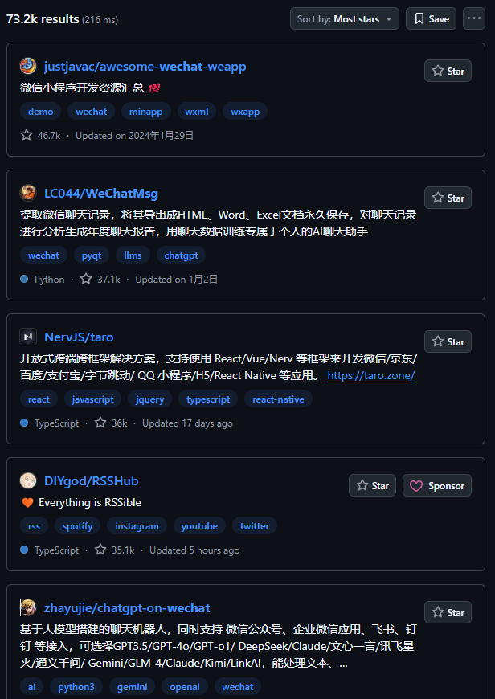

这里其他的排序方式分别是：

- Best match - 最佳匹配

- Most stars - 最多星标

- Fewest stars - 最少星标

- Most forks - 最多复刻

- Fewest forks - 最少复刻

- Recently updated - 最近更新

- Least recently updated - 最早更新

除了搜索仓库在左边我们还可以选择不同的筛选器来进行搜索

- Code - 代码

- Repositories - 仓库

- Issues - 议题

- Pull requests - 拉取请求

- Discussions - 讨论

- Users - 用户

- Commits - 提交

- Packages - 软件包

- Wikis

- Topics - 主题

- Marketplace - 市场

- Languages - 语言

比如说你不知道某函数库的某函数的使用方法你可以在Code里面搜索函数名找到大量相关代码来学习。

## 5.3 高级搜索

在Github的搜索页面搜索框下面有个advanced search链接点击即可进入高级搜索页面

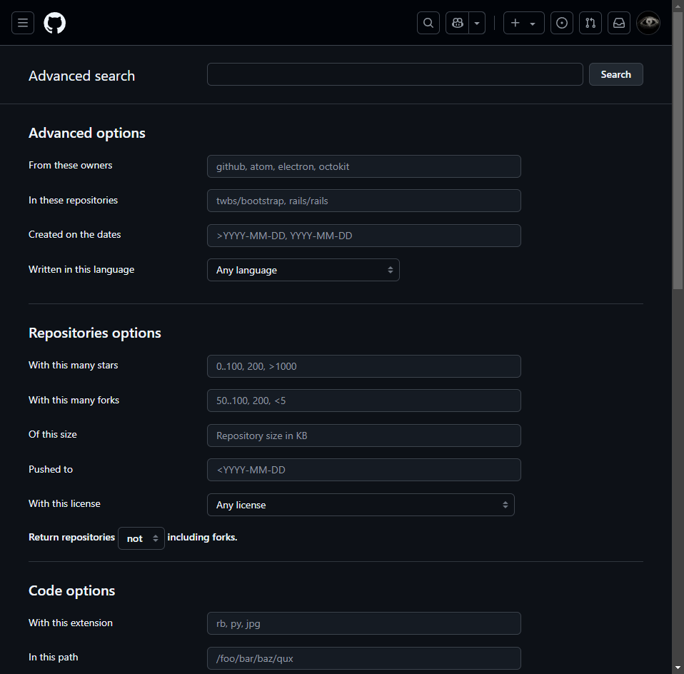

这里列出了很多很多的选项
**Advanced options - 高级选项**
From these owners - 指定作者
In these repositories - 指定仓库
Created on the dates - 创建日期
Written in this language - 使用语言

**Repositories options - 仓库选项**
With this many stars  - 指定星标数
With this many forks - 指定复刻数
Of this size - 仓库大小
Pushed to - 推送于
With this license - 用何种许可证
Return repositories not/and/only including forks. - 搜索结果 不/要/仅 包括复刻仓库

**Code options - 代码选项**
With this extension - 文件后缀
In this path - 文件路径
With this file name - 文件名称
Return code not/and/only including forks. - 搜索结果 不/要/仅 包括复刻仓库

**Issues options - 议题选择**
In the state - 议题状态
With the reason - 原因
With this many comments - 评论数量
With the labels - 议题标签
Opened by the author - 提议人
Mentioning the users - 提及谁
Assigned to the users - 分配给谁
Updated before the date - 更新于

**Users options - 用户选项**
With this full name - 用户全称
From this location - 来自哪里
With this many followers - 有多少关注者
With this many public repositories - 有多少公共仓库
Working in this language - 擅长什么语言

**Wiki options - Wiki选项**
Updated before the date - 更新于

当你在下方输入搜索条件的时候可以看到上方的搜索栏也同时会生成对应的搜索语句，在搜索页面我们时候这个搜索语句同样可以达成高级搜索的功能，如果你能记住这个语法的话。

## 5.4 收藏与关注

在项目的右上角点击Star★即代表你点赞收藏该项目

所有星标的项目可以在右上角点击头像点击Your stars查看

这个链接也可以https://github.com/stars

另外一种关注方式可以点击Watch按钮

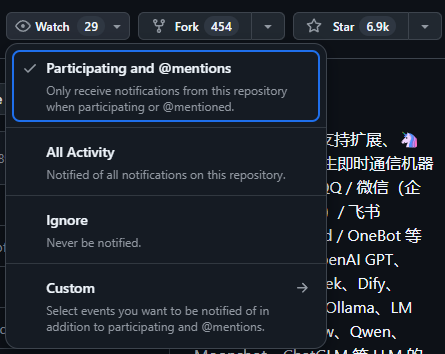

默认情况下只有参与了项目或者被@了才会收到消息推送

选择All Activity 就是项目所有消息都会推送给你

选择Ignore就是忽略项目所有消息

Custom可以定制你想要收到的推送

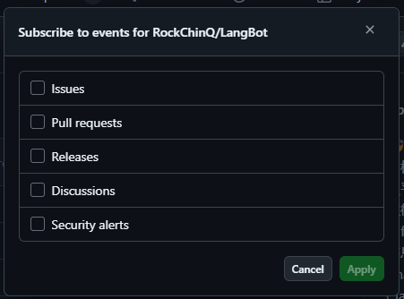

由上到下分别是：议题 / 拉取请求 / 发行版 / 讨论 / 安全警报

举个例子我勾选上Release如果项目有新版本发布我的邮件就会收到推送。

除了关注项目我们还可以关注用户，在用户的主页点击Follow按钮即可关注用户。

除了关注用户我们还可以关注组织，一样的在组织主页点击Follow按钮即可关注组织。

在自己主页的头像下面可以看到两个数据，Followers 关注你的人，Following你正在关注的。

## 5.5 保存源代码

如果你非常喜欢一个开源项目，想要保留他的源代码进行学习研究。

Github有三种方式可以保留它的源代码。

最简单的一种就是点击项目的绿色Code按钮点击Download ZIP下载全部代码。

第二种方式是使用Git的克隆指令

第三种方式是点击Fork进行项目复刻，这样就算原始仓库被删除掉，Fork出来的项目也会一直保留的。在自己Fork出来的项目可以点击Sync fork按钮将母项目的代码同步到子项目中。

## 5.6 下载软件

一般可以在项目页面的Release模块找到最新的版本号（Latest标签），点击进入在Assets里面即可看到项目所有安装包的下载链接。这里一般包括对应不同环境的安装包，我们来用来了解一下命名规则。

`aria2-1.37.0-win-64bit-build1.zip`

`aria2` 软件的名字

`1.37.0` 软件版本号

`win` 适用的操作系统（目前主流的操作系统有Windows/Linux/FreeBSD/Android/MacOS=Darwin）

`64bit` CPU架构（目前主流的CPU架构X86_64=AMD64=x64/arm/RISC-V/MIPS等）

`build1` 构建版本号

 有些开源项目作者并没有提供Release，一般可以在About找到项目官网

其他方式可能还有Docker、一键部署脚本等

## 5.7 使用源代码运行

最后一种办法就是下载源码运行，不过这个方法需要一定的编程基础知识，不过一般有几个通用流程。

1. 下载代码
2. 安装运行环境
3. 安装依赖
4. 找到入口文件，启动

还有就是仔细阅读README文档，一般都有介绍如何部署运行以及常见问题。

如果遇到问题不要忘了可以在Issue搜索相关情况，如果没有你也可以新建Issue提出议题然后期待社区帮助。
